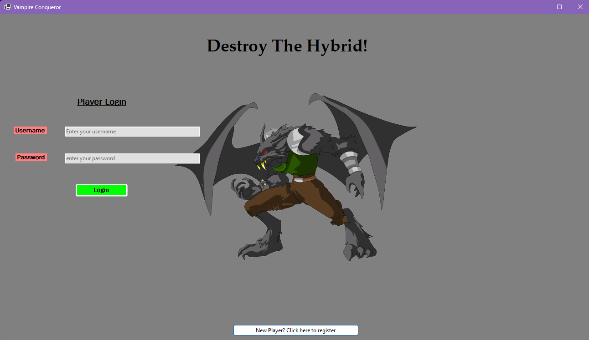

<html>
<head>
    <link rel="stylesheet" href="style.css">
    <title>CS 499 - Computer Science Capstone</title>
</head>
<body>

    <h1>CS 499 - Computer Science Capstone</h1>

Hi! My name is Shakira Baker, and I have attended Southern New Hampshire University for about two years. Before enrolling at SNHU, I had already successfully completed computer science related coursework at previous colleges and through my career in the Army National Guard. This ePortfolio highlights the skills I have developed throughout my computer science journey at SNHU. Below, you will find a link to a code review where I thoroughly explain the starting code and the enhancements I planned to make. You will also find a Professional Self-Assessment to further describe the valuable tools and knowledge I have gained during my time at SNHU, which have better prepared me to pursue various careers within the computer science field. Lastly, I have included a description of my capstone project which includes an explanation of how I satisfied the three required categories which are Software Design/Engineering, Algorithms and Data Structures, and Databases

        
Professional Self Assessment

        
Throughout my computer science journey, I have acquired an abundance of new knowledge and skills that have shaped both my professional goals and my values. I now have a stronger understanding of the diverse skill set necessary to pursue a career in this field. I have learned how to collaborate effectively in a team environment through agile development practices, develop applications in several different languages, implement secure coding practices to prevent vulnerabilities, and apply object-oriented programming (OOP) principles to design efficient, modular systems. In DAD 220 Introduction to Structured Database Enviornments and CS 340 Client/Server Development, I expanded my SQL knowledge by creating projects using MySQL and MongoDB, including building a Python visualization tool to display database data. In CS 250 Software Development Life Cycle, I learned about different development processes, such as the Waterfall and Agile methods, and the specific responsibilities of each role within a Scrum team, highlighting the importance of constant stakeholder communication and frequent testing.
Through my coursework, I also gained experience working with development tools such as MATLAB, Android Studio, PyCharm, Visual Studio, and Visual Studio Code. I developed skills in several programming languages, including Java, JavaScript, Python, C#, C++, and HTML. In addition to understanding the importance of writing secure code by implementing input validation and error handling, I also learned how to thoroughly test my code through unit testing, including creating JUnit tests in my Software Test, Automation, and QA course. I strengthened my knowledge of data structures and algorithms by learning to build and work with arrays, dictionaries, and trees to create efficient, scalable solutions.
Being exposed to such a wide variety of technologies and methodologies throughout the program helped me narrow down my career interests, ultimately leading me to pursue a career in data analysis or data engineering. My coursework taught me what is expected of a developer, how to interact effectively with stakeholders, and the importance of maintaining flexibility and continuous improvement in collaborative team settings.
For my capstone, instead of selecting three separate artifacts, I chose to enhance a single project to satisfy the three required categories. This allowed me to better demonstrate the depth of my growth throughout my time at SNHU. This entire ePortfolio showcases my skills in key areas such as security, object-oriented programming, professional-quality documentation, database design and CRUD operations, UI/UX design, and problem solving. It serves as a complete demonstration of the technical abilities and professional competencies I have developed, and highlights my readiness to contribute meaningfully to the computer science field.

    
Code Review

    
This is my code review providing a more in depth explanation of the project I chose to enhance and the changes I plan to make to improve the project.

    

        <a href="https://github.com/SNHU-Shakira13/SNHU-Shakira13.github.io/blob/main/TextBasedGame.py" target="_blank">Orginal Text Based Game Python Code</a>
    

    

        <a href="https://drive.google.com/file/d/1TppenujYq8zQyBxP8UxVRcQMRahrPOal/view?usp=drive_link" target="_blank">Watch Code Review Part 1</a>
    

    

        <a href="https://drive.google.com/file/d/1hBxWl3TuKWJgc8fN1FtX9Rb2k8O1Kxcm/view?usp=drive_link" target="_blank">Watch Code Review Part 2</a>
    

     

        
Project Details

        
The artifact I chose to enhance is one of the first projects I completed when I started my journey at SNHU back in January or February of 2023. It is a text-based video game that I developed using Python in IT 140: Introduction to Scripting. The goal of the project was to develop a text-based video game that allowed a user to enter the text “Go North, Go South, Go East, or Go West” to navigate through a maze of rooms that was provided to us. We were able to decide the theme of the game, what each room would be, and what items would be available to collect in each room. Each room only had certain directions available depending on the direction of the openings displayed in the provided map. The player had to visit each room and collect an item to have everything necessary to kill the boss in the final room. If the player failed to collect all the items they would lose the boss fight, otherwise they would succeed. I chose this artifact because it was a simple project with a lot of potential, and I knew that with more development knowledge and skills, I could take it much further. Even in its original form, the project demonstrated my ability to code in Python, write modular functions for specific tasks, and create well-organized, well-commented code that was easy to follow. I enjoyed building it and wanted to improve the user experience by making it more engaging.

 The room map is necessary to know how to navigate the game. The link to my final project file is necessary due to my zipped project file being to large so I stored it in google drive.

    

<a href="https://github.com/SNHU-Shakira13/SNHU-Shakira13.github.io/blob/main/Room_Map.png" target="_blank">View Room Map</a>

<a href="https://drive.google.com/file/d/10oJMcIaMcSrYYDL8PaNwtQJ_ka3ys6HX/view?usp=sharing" target="_blank">View Final Project Zip File</a>
 

    
        
🛠️<b>Software Design/Engineering</b>

       

 To satisfy this category I enhanced the project significantly by converting it from Python to C#, restructuring it into multiple classes and methods. I added a database to support user login, saving, and loading game states, which didn't exist before. I’ve also started building the interface using WinForms, separating the login and game screens into two forms for better organization. Security features like input validation, password masking, and character limits were added to the login screen, along with password hashing for secure storage and verification. I implemented error handling to avoid null values and improve performance, and used internal classes with private variables accessed through getters and setters to strengthen encapsulation. These improvements highlight my growth in software development, from basic scripting to building more complex, secure, and user-friendly applications.

<a href="https://docs.google.com/document/d/1Bn8jD2zA60d_ZN3KMp5ZLlrkfw2g1LL8/edit?usp=sharing&ouid=117042052524620273462&rtpof=true&sd=true" target="_blank">View full software design/engineering narrative</a>
  
        

📚 <b>Algorithms and Data Structures</b>

To satisfy the Algorithms and Data Structures category, I expanded the project’s complexity by adding a graphical user interface using WinForms and integrating a database to allow players to save and load their game states. I also implemented a secure hashing algorithm to protect player passwords, improved the MovePlayer method for more efficient handling of UI button clicks, and optimized the WinForms interface by reusing controls to improve performance. Creating the WinForms interface showcases my ability to design a functional UI that dynamically hides or displays controls as needed. Integrating the database demonstrates my skills in building an SQLite database connected to the UI and developing methods to manipulate data directly through the interface. Additionally, my object-oriented programming skills are reflected in how I restructured the entire project into multiple classes, applied encapsulation, and transitioned from standalone functions to methods within internal classes, each serving a specific role in the overall functionality of the game.

<a href="https://docs.google.com/document/d/1rI7qoAdx2kuGoCfD7rfV00hYFet06nYM/edit?usp=sharing&ouid=117042052524620273462&rtpof=true&sd=true" target="_blank">View full algorithms and data structures narrative</a>
  

🗄️ <b>Databases</b>

To satisfy the Database category, I created a database using SQLite and integrated it into the project to allow players to create accounts and save their game progress. Players can now start a new game or continue from a saved state, a feature that did not exist in the original project. I developed methods to provide full CRUD functionality and connected these methods to buttons in the WinForms UI, allowing database actions to be performed directly through user interactions. The database includes two well-structured tables, one for user login details and another for tracking player progress. I designed both tables to enforce data integrity by preventing null values in critical fields and ensuring that primary key columns are unique. These design choices showcase my ability to implement effective schema design and input validation. I also demonstrated secure coding practices by using parameterized queries to protect against SQL injection attacks. Additionally, I ensured that the database tables are only created if they do not already exist and implemented logic to update an existing save rather than creating duplicate entries, maintaining data consistency by leveraging the unique username constraint. Through these enhancements, I’ve demonstrated my ability to design, implement, and securely integrate a functional database within a desktop application.

<a href="https://docs.google.com/document/d/1mVORKfk-bxAlzZaNL5ViK4xm4ZHK3ZQY/edit?usp=sharing&ouid=117042052524620273462&rtpof=true&sd=true" target="_blank">View full databases narrative</a>  

</body>
</html>

